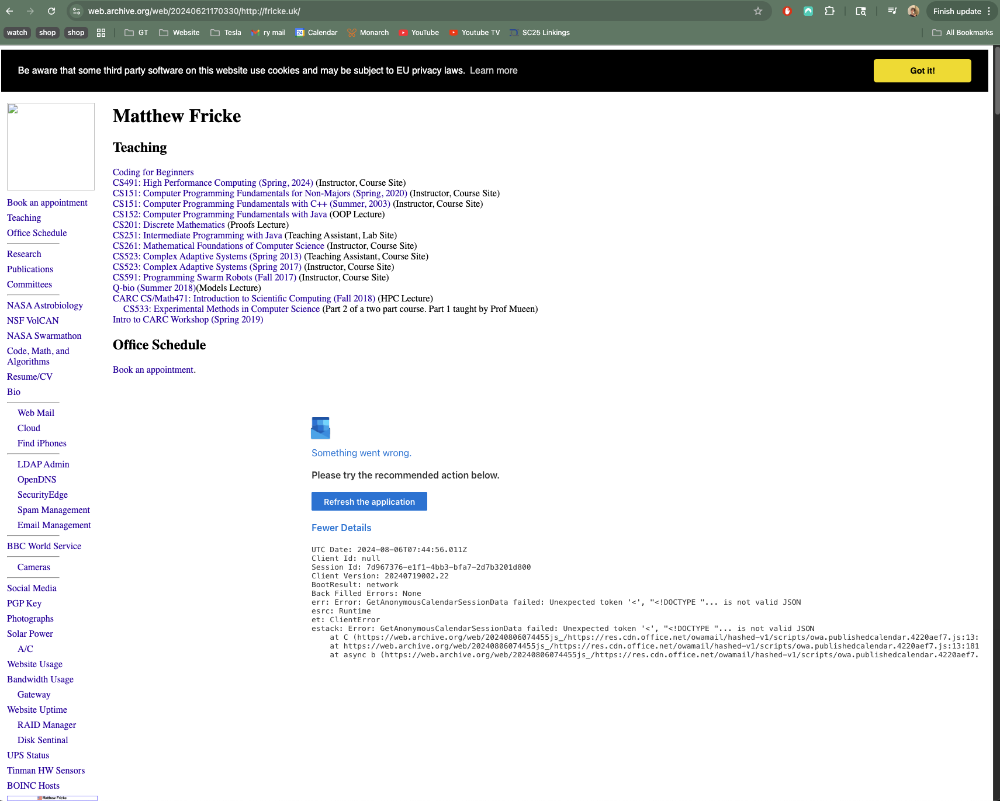
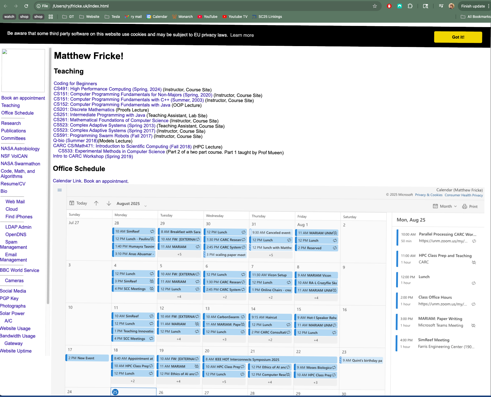

# fricke.uk

Matthew's website has always been fricke.co.uk. One day I noticed that fricke.uk was available for only a dollar or two per year. 

In my owning fricke.uk it then looks like fricke.co.uk is the fraudulent site. I wanted to take it over and make a subtle change.

## Before

## After

